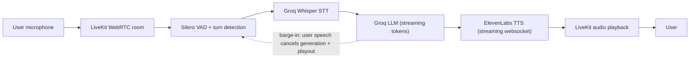

# Real-Time AI Voice Agent

Low-latency, natural-sounding conversational voice agent.

**Pipeline:** Mic → LiveKit WebRTC → Silero VAD / turn detection → Groq Whisper STT → Groq LLM (streaming) → ElevenLabs TTS (websocket streaming) → LiveKit playback.

Built on **LiveKit Agents 1.8** (`AgentServer` / `AgentSession`). Streaming and barge-in are native: LLM tokens stream into ElevenLabs as they arrive (no waiting for the full response), and user speech immediately interrupts playout and cancels remaining generation.

## Architecture



```text
backend/
├── agent.py            # AgentServer entrypoint, session wiring, barge-in config
├── config.py           # Single config layer (models, voice, temp, tokens, env validation)
├── prompts.py          # Editable system prompt + greeting
├── services/
│   ├── stt.py          # Groq Whisper STT factory
│   ├── llm.py          # Groq LLM factory (streaming)
│   └── tts.py          # ElevenLabs TTS factory (streaming websocket)
├── utils/latency.py    # [VOICE]/[STT]/[LLM]/[TTS] latency logging
├── token_api.py        # FastAPI token server (secrets stay server-side)
├── requirements.txt    # pip mirror of pyproject.toml
└── .env.example

frontend/
└── Next.js client: token fetch → LiveKit room → mic + agent audio + live transcript
```

## Setup

1. **Install dependencies**

   ```bash
   # backend (uv, recommended)
   cd backend
   uv sync
   # or: pip install -r requirements.txt

   # frontend
   cd ../frontend
   npm install
   ```

2. **Create `.env`**

   ```bash
   cp backend/.env.example backend/.env
   ```

3. **Add API keys** in `backend/.env`:

   - `GROQ_API_KEY` — https://console.groq.com/keys
   - `ELEVENLABS_API_KEY` (+ optional `ELEVENLABS_VOICE_ID`) — https://elevenlabs.io
   - `LIVEKIT_URL`, `LIVEKIT_API_KEY`, `LIVEKIT_API_SECRET` — LiveKit Cloud project keys (or your self-hosted server)
   - Models, voice, temperature, max tokens, and the system prompt are all configurable — see `.env.example` and `backend/prompts.py`.

4. **Start the agent worker**

   ```powershell
   cd backend
   .venv\Scripts\activate          # PowerShell: activate the venv first
   python agent.py dev
   # or: uv run agent.py dev
   # or, with the LiveKit CLI (recommended, adds hot-reload + console):
   #   lk agent dev
   ```

   Keep this terminal open — it registers the worker and joins rooms on demand.

5. **Start the token server** (second terminal, venv activated)

   ```powershell
   cd backend
   .venv\Scripts\activate
   python -m uvicorn token_api:app --port 8000
   ```

6. **Start the frontend** (third terminal)

   ```bash
   cd frontend
   npm run dev
   ```

7. **Open the application**

   http://localhost:3000 → click **Start conversation** → allow microphone → start speaking.

## Latency monitoring

The agent logs structured timings on every turn (from `backend/utils/latency.py`):

```text
[VOICE] User speech started
[VOICE] User speech ended
[STT]   Transcript received: "..." (stt_latency=...)
[LLM]   First token latency: ...
[TTS]   First audio latency: ...
[VOICE] Response started
[VOICE] Total perceived latency (speech end -> first audio): ... ms
[VOICE] Response completed
[VOICE] Response interrupted
```

Measured metrics per turn:

| Metric | Meaning |
|---|---|
| STT latency | user stops speaking → transcript final |
| LLM first-token (TTFT) | transcript → first LLM token |
| TTS first-audio (TTFB) | request → first TTS audio chunk |
| Total perceived latency | user stops speaking → first audible response |

Preemptive generation is enabled (`TurnHandlingOptions`), so the LLM starts generating as soon as VAD detects end-of-turn, further reducing perceived latency.

> Live per-turn numbers are recorded during a real session with valid API keys; run the setup above and read them straight off the agent worker console.

## Security

- `GROQ_API_KEY`, `ELEVENLABS_API_KEY`, `LIVEKIT_API_SECRET` are used **only** in the backend and never sent to the browser or logged.
- `backend/token_api.py` issues short-lived room-join tokens; the frontend receives only `{serverUrl, token, roomName}`.
- `.env` is git-ignored; `.env.example` contains names only.

## Limitations / notes

- Groq Whisper STT is segment-based (transcribes at end of speech), not token-streamed — this is inherent to the current Whisper API.
- ElevenLabs `eleven_turbo_v2_5` is the default for latency; set `ELEVENLABS_MODEL_ID` to change it.
- **TTS provider switch:** `TTS_PROVIDER=elevenlabs` (default) or `TTS_PROVIDER=groq` (OpenAI-compatible `canopylabs/orpheus-v1-english` on your existing Groq key — useful when ElevenLabs is on the free tier; requires one-time terms acceptance in the Groq console).
- The `agent_name`-in-code deprecation warning in dev mode is expected; LiveKit recommends the `lk` CLI (`lk agent dev`), which also gives you the Agent Console.
- ElevenLabs websocket connections are reused across turns; a fresh connection costs ~100–200 ms on the first turn only.
